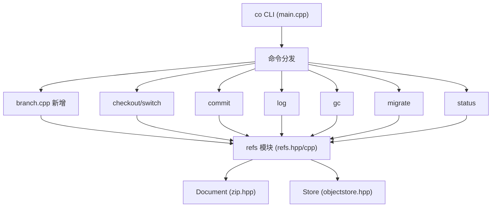

# 2026-08-06 Branch 功能技术设计

Feature Name: branch-management
Updated: 2026-08-06

## Description

为 `co` 引入 Git 风格的分支机制。当前仓库仅有一个 `.co/HEAD` 指针直接存储 commit hash，无法保存多条命名开发线。本功能新增：

1. **命名引用空间** `.co/refs/heads/<name>`，每个条目存储一条 commit hash。
2. **符号 HEAD（symbolic ref）**：`.co/HEAD` 可写 `ref: refs/heads/<name>` 表示当前分支；写纯 hash 表示分离 HEAD。
3. **命令**：`co branch`（列出）、`co branch <name>`（创建）、`co branch -d <name>`（删除）、`co switch <branch>`（切换分支，`co checkout <branch>` 同时支持）。
4. **commit 推进语义**：符号 HEAD 下 commit 推进当前分支指针；分离 HEAD 下保持直接写 hash。

向后兼容：旧仓库 `.co/HEAD` 为纯 hash，自动视为分离 HEAD；旧行为在新机制下保持可用。

## Architecture



核心抽象：新增 `refs.hpp/cpp` 模块，提供分支引用的读写、列举、校验与符号 HEAD 解析。`Store::head()`/`setHead()` 保留作为底层文件读写，新增高层 refs 解析层供各命令使用。

### 关键设计决策

- **符号 HEAD 格式**：`ref: refs/heads/<name>`，与 Git 一致。`Store::head()` 保持返回原始内容，新模块负责符号解析。理由：旧仓库（纯 hash）无需任何迁移即可读取；首个 commit 时若 HEAD 为空则自动初始化 `main` 分支并符号指向。
- **refs 存储**：复用 `Document::set/get/remove/list`，与对象存储同机制，天然支持外部 bundle 模式（historyDoc 即 bundle）。
- **默认分支**：仓库无任何分支且首次 commit 时自动创建 `main` 并符号指向。`init` 不预创建（保持 init 幂等），`branch` 创建时校验 HEAD 存在。
- **commit 推进**：`createCommitExternal` 中读取符号 HEAD 解析出分支名与父 commit，写 commit 后推进对应分支引用；分离 HEAD 时直接 `setHead`。
- **迁移兼容**：`migrate` 重写 HEAD 后同时重写所有 `refs/heads/*` 引用。

## Components and Interfaces

### 新增模块：`src/refs.hpp` / `src/refs.cpp`

```cpp
namespace co {

// 符号 HEAD 前缀
inline constexpr const char* kRefsHeadsDir = ".co/refs/heads";
inline constexpr const char* kRefPrefix = "ref: ";

// 分支名校验：非空、无空白与特殊字符、不以 . 开头、不以 .lock 结尾
bool isValidBranchName(const std::string& name);

// 列出所有分支名（按字母序）
std::vector<std::string> listBranches(const Document& doc);

// 读取分支指向的 commit hash（条目不存在返回空串）
std::string getBranchHash(const Document& doc, const std::string& name);

// 写/更新分支引用（name 非法则返回 false）
bool setBranch(const Document& doc, const std::string& name, const std::string& hash);

// 删除分支引用（name 非法或条目不存在返回 false）
bool deleteBranch(const Document& doc, const std::string& name);

// HEAD 结构：符号指向分支，或分离 hash
struct HeadRef {
    bool symbolic = false;        // true=符号指向分支，false=分离
    std::string branch;           // symbolic 时的分支名
    std::string hash;             // 解析出的 commit hash（可能为空）
    bool hashPresent = false;     // HEAD 文件是否存在且有内容
};

// 解析 HEAD：读 .co/HEAD，识别 ref: 前缀，返回解析结构（含分支解析后的 commit hash）
HeadRef resolveHead(const Document& doc);

// 读取 HEAD 的实际 commit hash（等价于 Git rev-parse HEAD，含符号解析）
std::string headCommitHash(const Document& doc);

// 当前分支名：符号 HEAD 返回分支名，分离返回空串
std::string currentBranch(const Document& doc);

// 将 HEAD 设为符号指向分支（分支不存在返回 false）
bool attachHead(Document& doc, const std::string& branch);

// 将 HEAD 设为分离 hash（写纯 hash）
void detachHead(Document& doc, const std::string& hash);

// 提交时推进当前分支：符号 HEAD 推进分支引用；分离直接写 HEAD。返回推进后指向的 hash。
std::string advanceHead(Document& doc, const std::string& newHash);

}
```

### 修改：`objectstore.hpp/cpp`

- 保留 `head()`/`setHead()` 为底层纯读写（不改语义，避免影响 status/merge/import 等处对裸 hash 的既有使用）。
- `kHeadFile` 常量不变。

### 修改：`commit.cpp`

- `createCommitExternal`：`parent = store.head()` 改为 `parent = headCommitHash(historyDoc)`；`store.setHead(commitHash)` 改为 `advanceHead(historyDoc, commitHash)`。
- `createMergeCommit`：同上，用 `advanceHead`。
- `checkoutCommitExternal`：保持调用方设置 HEAD；由 checkout/switch 命令统一处理 attach/detach。
- `logCommits`：`current = store.head()` 改为 `current = headCommitHash(doc)`。

### 修改：`main.cpp`

- 新增 `printBranchUsage`、`printSwitchUsage`，注册到 `commandUsage`/`printCommandUsage`/`main` 分发。
- 新增 `handleBranch`、`handleSwitch`。
- `handleCheckout`：`resolveRef` 已支持分支名（见下），并在 checkout 成功后将 HEAD attach 到该分支；若 checkout 的参数为纯 hash 则保持 detach。

### 修改：`status.cpp`

- `resolveRef`：新增分支名解析。`refs/heads/<name>` 或裸分支名（当 `refs/heads/<name>` 存在）返回对应 commit hash；前缀匹配逻辑保持不变（对 HEAD 链）。若以 `refs/` 开头，尝试匹配 refs/heads 下的引用。
- `computeStatus`：`head` 改为 `headCommitHash(historyDoc)`，输出增加当前分支名（`currentBranch`）。

### 修改：`gc.cpp`

- `garbageCollect`：标记起点从单一 HEAD 扩展为 HEAD + 所有分支引用（`listBranches` + `getBranchHash`），确保未合并分支对象不被误删。

### 修改：`migrate.cpp`

- `migrateStore`：迁移后除 `setHead(newHead)` 外，遍历所有分支引用，将每条引用的旧 hash 经 `Migrator::migrateCommit` 转换后更新（写目标算法 hash 到同名引用）。
- `Migrator` 暴露/提供 `migrateCommit(const std::string&)` 的复用入口（已有，可直接调用）。

### 修改：`bundle.cpp`

- `copyCoEntries`：当前按 `.co/` 前缀整体复制，分支引用（`.co/refs/...`）自然随复制带出，无需改动。验证：`copyCoEntries` 遍历非 content 条目整体拷贝。
- `writeRedactedHistory`：BFS 起点需扩展为 HEAD + 所有分支，否则 redact 导出会遗漏非 HEAD 分支的 commit/tree 对象。
- `importBundle`：确认 bundle 中若含 `.co/refs/` 条目时整体复制逻辑（与 export 对称）。

### 修改：`merge.cpp`

- `bundleMerge` 使用 `Store::head()` 读取两端 HEAD；若 bundle 为符号 HEAD，需改用 `headCommitHash`。其余逻辑不变。

## Data Models

### `.co/HEAD` 内容

| 形式 | 内容 | 含义 |
|------|------|------|
| 符号 | `ref: refs/heads/main\n` | HEAD 符号指向 `main` 分支 |
| 分离 | `<commit-hex>\n` | HEAD 直接指向 commit |
| 空/缺失 | （无内容） | 仓库无提交 |

### `.co/refs/heads/<name>` 内容

单行 commit hash + `\n`。名称 `<name>` 合法字符约束见 `isValidBranchName`。

### 解析流程（`resolveHead`）

```
读 .co/HEAD
├─ 缺失或空 → HeadRef{hashPresent:false}
└─ 以 "ref: " 开头
   ├─ ref 部分匹配 refs/heads/<name> → 读该引用
   │    ├─ 存在 → HeadRef{symbolic:true, branch, hash}
   │    └─ 不存在 → HeadRef{symbolic:true, branch, hashPresent:false}（悬空）
   └─ 否则按分离处理 → HeadRef{hash}
```

## Correctness Properties

1. **符号引用原子性**：`advanceHead` 要么推进分支引用要么写 HEAD，单一写操作，不存在中间态。
2. **默认分支单一性**：仓库首次 commit 自动创建 `main` 后，后续 commit 不会重复创建默认分支（创建条件：`listBranches` 为空且 HEAD 空）。
3. **删除保护**：`co branch -d` 拒绝删除当前分支；`deleteBranch` 对缺失条目返回 false。
4. **gc 可达性**：所有分支引用指向的 commit 及其祖先必达（标记起点含全部 refs），删除分支后的孤立对象可由下次 gc 清理。
5. **migrate 完整性**：迁移后 HEAD 与所有分支引用均指向目标算法 hash，无残留旧算法引用。
6. **旧仓库兼容**：`.co/HEAD` 为纯 hash 时，所有命令行为与迁移前一致（分离 HEAD 语义等价于旧版）。
7. **resolveRef 一致性**：分支名解析优先于前缀 hash 匹配，避免分支名与 hash 前缀混淆；`refs/` 前缀显式引用分支路径。

## Error Handling

| 场景 | 行为 |
|------|------|
| `co branch <name>` 分支已存在 | 报错 `fatal("branch already exists: <name>")` |
| `co branch <name>` 仓库无 HEAD | 报错 `fatal("cannot create branch: repository has no commits")` |
| `co branch <name>` 分支名非法 | 报错并提示合法约束 |
| `co branch -d <name>` 当前分支 | 报错拒绝 |
| `co branch -d <name>` 分支不存在 | 报错 `fatal("branch not found: <name>")` |
| `co switch <branch>` 分支不存在 | 报错 `fatal("switch failed: <branch>")` |
| `co checkout <branch>` 分支不存在 | 保持既有 checkout 错误路径 |
| 符号 HEAD 指向缺失引用 | 按分离处理（悬空 HEAD），`headCommitHash` 返回空串，log/status 报无提交 |
| 外部模式下 refs 写入失败 | 沿用既有 bundle 写回失败路径（`writeBundleWithManifest` 返回 false → fatal） |

## Test Strategy

单元测试按模块覆盖（沿用现有 C++ 测试风格，若仓库有测试框架则对齐）：

1. **refs 模块**：分支名校验（合法/非法边界）、get/set/delete 往返、`resolveHead` 三分支（符号/分离/空）、`attachHead`/`detachHead`/`advanceHead` 状态转换。
2. **commit 推进**：符号 HEAD 下 commit 推进分支引用且 HEAD 符号形式不变；分离 HEAD 下 commit 直接写 hash。
3. **命令集成（构建二进制实测）**：
   - `init` → `commit` → `branch`（列出含 `* main`）→ `branch dev` → `switch dev` → `commit` → `switch main` → `log` 各分支历史独立。
   - `branch -d main` 拒绝；`branch -d dev` 成功。
   - `checkout <branch>` 内容恢复 + 符号 HEAD 设置。
   - `gc` 后未合并分支对象保留。
   - `migrate` 后所有分支引用重写。
   - `status` 显示当前分支名。
   - `--external` bundle 模式全流程。

## References

[^1]: (src/objectstore.hpp) - Store::head/setHead 与 kHeadFile 定义
[^2]: (src/commit.cpp#L405-L426) - createCommitExternal 的 parent/setHead
[^3]: (src/commit.cpp#L469-L485) - logCommits 沿 HEAD 链遍历
[^4]: (src/gc.cpp#L121-L129) - gc 从 HEAD 标记可达
[^5]: (src/status.cpp#L17-L58) - resolveRef 当前 ref 解析
[^6]: (src/migrate.cpp#L169-L205) - migrateStore 重设 HEAD
[^7]: (src/bundle.cpp#L232-L263) - writeRedactedHistory 从 HEAD BFS
[^8]: (src/merge.cpp#L200-L203) - bundleMerge 读取两端 HEAD
